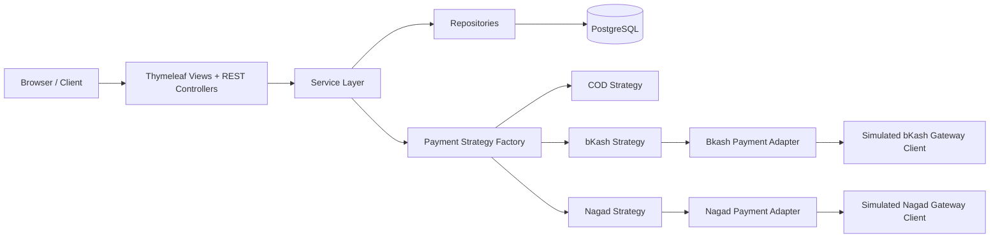
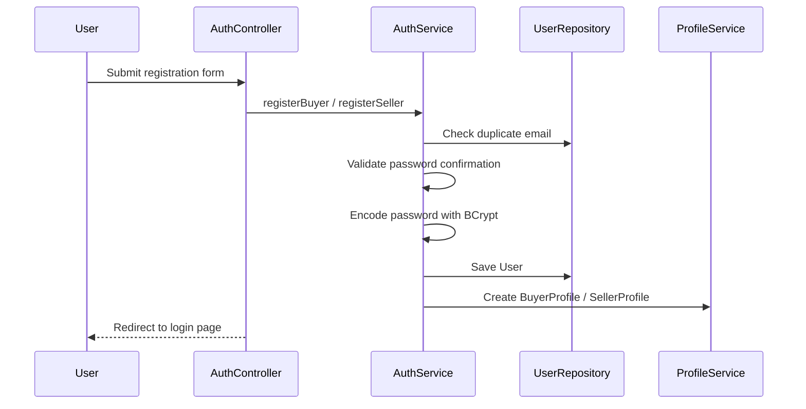
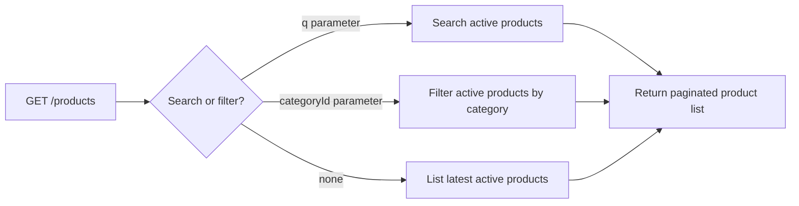
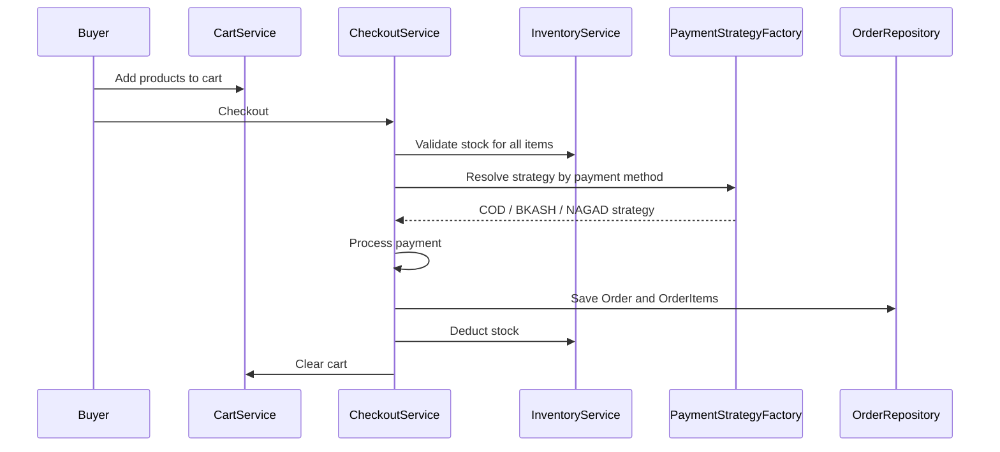
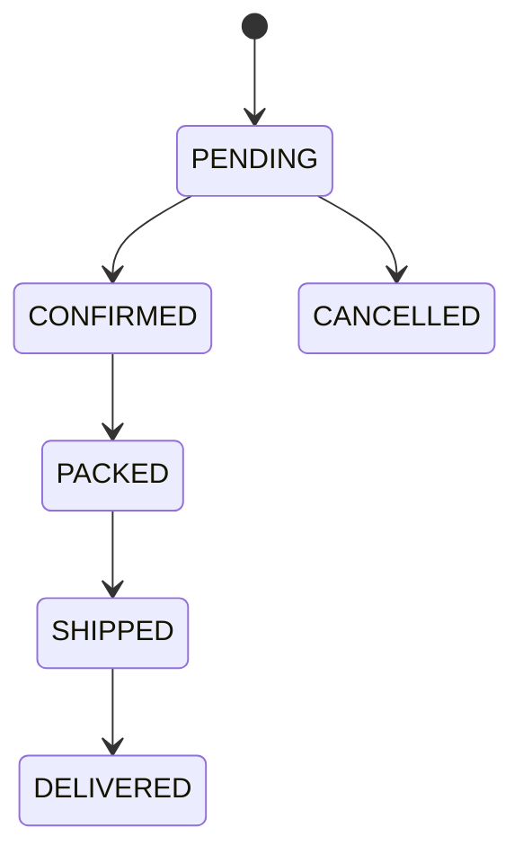
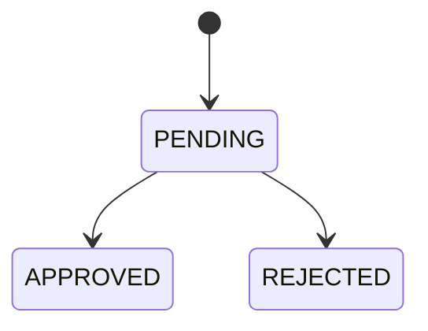
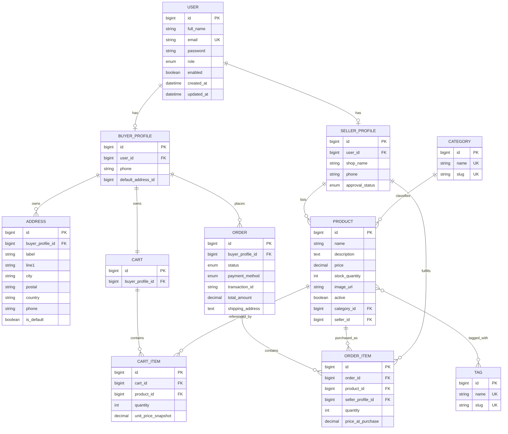
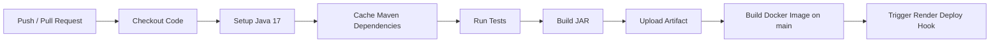

# Mini Market Place

> A full-stack **role-based marketplace platform** built with **Spring Boot**, **Thymeleaf**, **Spring Security**, **PostgreSQL**, **Docker**, and **GitHub Actions**.
>
> The system supports three roles — **Admin**, **Seller**, and **Buyer** — and implements a complete commerce flow from product browsing to cart, checkout, payment strategy selection, order tracking, seller moderation, and administrative control.


---

## Table of Contents

1. [Project Overview](#project-overview)
2. [Core Features](#core-features)
3. [Role-Based Access Model](#role-based-access-model)
4. [Architecture Overview](#architecture-overview)
5. [Request and Business Flows](#request-and-business-flows)
6. [Database Design](#database-design)
7. [Security Design](#security-design)
8. [Design Patterns and Engineering Decisions](#design-patterns-and-engineering-decisions)
9. [Project Structure](#project-structure)
10. [Web Endpoints](#web-endpoints)
11. [REST API Endpoints](#rest-api-endpoints)
12. [API Response Format](#api-response-format)
13. [Environment Variables](#environment-variables)
14. [How to Run the Project](#how-to-run-the-project)
15. [Docker Setup](#docker-setup)
16. [Testing](#testing)
17. [CI/CD Pipeline](#cicd-pipeline)
18. [Seed Data and Startup Behavior](#seed-data-and-startup-behavior)
19. [Future Improvements](#future-improvements)
20. [Authors / Team](#authors--team)

---

## Project Overview

**Mini Market Place** is a server-rendered marketplace web application where:

- **Buyers** can register, manage addresses, browse products, add items to cart, place orders, track order history, and cancel pending orders.
- **Sellers** can register, manage their shop profile, wait for admin approval, create/update/delete products, and process order fulfillment.
- **Admins** can review sellers, manage users, moderate products, monitor platform activity, and inspect all orders.

The system combines:

- **Spring MVC + Thymeleaf** for web pages
- **REST APIs** for JSON-based operations
- **Spring Security** for authentication and route protection
- **PostgreSQL + Spring Data JPA** for persistence
- **Docker** for containerized execution
- **GitHub Actions** for automated testing, build, image build, and deployment hook triggering

This project is designed to demonstrate not only feature completeness, but also **clean layering**, **DTO usage**, **exception handling**, **role-based authorization**, **payment extensibility**, and **deployment readiness**.

---

## Core Features

### Public Features

- Public product catalog
- Product search and category filtering
- Public product detail page
- Buyer registration
- Seller registration
- Form-based login using email and password

### Buyer Features

- Buyer dashboard
- Buyer profile management
- Address book management
- Default address selection
- Shopping cart
- Checkout with payment method selection
- Order history and order detail view
- Cancel pending order

### Seller Features

- Seller dashboard
- Seller profile management
- Seller approval workflow
- Product CRUD (create, edit, delete)
- Product tagging and categorization
- Seller-side order processing
- Order status advancement

### Admin Features

- Admin dashboard statistics
- User listing
- Seller approval and rejection
- Product moderation (activate/deactivate)
- Full order visibility
- Admin JSON APIs for stats, users, sellers, products, and orders

### Engineering Features

- BCrypt password hashing
- DTO-based REST responses
- Global exception handling for both HTML and API requests
- Role-based redirection after login
- Payment processing abstraction with extensible strategy factory
- Dockerized application and database
- CI/CD pipeline through GitHub Actions

---

## Role-Based Access Model

| Role | Main Responsibilities |
|---|---|
| **ADMIN** | Review seller applications, monitor users, moderate products, inspect all orders, access dashboard statistics |
| **SELLER** | Manage seller profile, create/update/delete products, view seller orders, advance order status |
| **BUYER** | Manage profile and addresses, browse products, manage cart, checkout, review/cancel orders |

### Role Rules

- A new **buyer** account is immediately usable after registration.
- A new **seller** account is created with **`PENDING`** approval status.
- A seller must be **approved by admin** before accessing product creation flow.
- Only **buyers** can access cart and checkout endpoints.
- Only **admins** can access administrative routes and moderation endpoints.

---

## Architecture Overview

The project follows a **layered architecture** with a clear separation between presentation, business logic, and persistence.



### Layer Responsibilities

| Layer | Main Components | Responsibility |
|---|---|---|
| **Presentation Layer** | Controllers, Thymeleaf templates | Handles HTTP requests, renders views, returns JSON |
| **Service Layer** | Auth, Buyer, Seller, Product, Cart, Checkout, Order services | Implements business rules and workflows |
| **Persistence Layer** | JPA entities and repositories | Stores and retrieves application data |
| **Cross-Cutting Layer** | Security config, DTO mapper, exception handler, data initializer | Handles authentication, data mapping, startup seeding, error responses |
| **Integration Layer** | Payment strategies, adapters, gateway clients | Encapsulates payment processing behavior |

---

## Request and Business Flows

### 1. Authentication Flow



### 2. Product Browsing Flow



### 3. Checkout Flow



### 4. Order Lifecycle



### 5. Seller Approval Lifecycle



---

## Database Design

All entities inherit from `BaseEntity`, which provides:

- `id`
- `createdAt`
- `updatedAt`

### Main Entities

- `User`
- `BuyerProfile`
- `SellerProfile`
- `Address`
- `Category`
- `Tag`
- `Product`
- `Cart`
- `CartItem`
- `Order`
- `OrderItem`

### Entity Relationship Diagram



### Important Relationship Notes

- A `User` stores authentication and role data.
- A buyer has a dedicated `BuyerProfile`.
- A seller has a dedicated `SellerProfile`.
- A seller owns many `Product` rows.
- A product belongs to one `Category` and can have many `Tag`s.
- A buyer has exactly one `Cart`.
- An `Order` belongs to a buyer and contains multiple `OrderItem`s.
- Each `OrderItem` references the seller responsible for fulfilling that product.

---

## Security Design

The application uses **Spring Security** with form login and role-based route protection.

### Security Features

- Custom login page: `/login`
- Email-based authentication (`usernameParameter("email")`)
- Password hashing with `BCryptPasswordEncoder`
- Session-based authentication
- Role-based authorization per route group
- Role-based redirect after successful login
- Custom access denied page: `/error/403`
- H2 console allowed only for local development support

### Route Protection Summary

| Route Pattern | Access |
|---|---|
| `/`, `/products/**`, `/api/products/**`, `/api/categories/**` | Public |
| `/register/**`, `/login`, `/css/**`, `/js/**`, `/images/**` | Public |
| `/buyer/**`, `/api/buyer/**`, `/api/cart/**`, `/api/orders/**` | BUYER |
| `/seller/**`, `/api/seller/**` | SELLER |
| `/admin/**`, `/api/admin/**` | ADMIN |

### Login Redirects

| Role | Redirect Target |
|---|---|
| ADMIN | `/admin/dashboard` |
| SELLER | `/seller/dashboard` |
| BUYER | `/buyer/dashboard` |

---

## Design Patterns and Engineering Decisions

### 1. Layered Architecture
The codebase separates controllers, services, repositories, entities, DTOs, and configuration classes to keep responsibilities clean.

### 2. Strategy Pattern
Payment processing is implemented using the `PaymentStrategy` interface with concrete strategies:

- `CodPaymentStrategy`
- `BkashPaymentStrategy`
- `NagadPaymentStrategy`

This keeps checkout extensible and avoids large conditional blocks.

### 3. Factory Pattern
`PaymentStrategyFactory` auto-discovers and returns the correct payment strategy based on `PaymentMethod`.

### 4. Adapter Pattern
Gateway clients for bKash and Nagad expose different interfaces. Adapters normalize them into a shared `PaymentGatewayPort` contract.

- `BkashPaymentAdapter`
- `NagadPaymentAdapter`

### 5. DTO Mapping
REST responses use DTOs instead of directly exposing entities. Mapping is centralized through `DtoMapper`.

### 6. Global Exception Handling
`GlobalExceptionHandler` produces:

- HTML error pages for MVC requests
- structured JSON responses for API requests

### 7. Audit Base Entity
`BaseEntity` standardizes timestamps and primary key behavior across all entities.

### 8. Startup Seeding + Migration
Startup runners seed admin/category/tag data and perform a lightweight data-fix migration for existing orders with null payment methods.

---

## Project Structure

```text
src/main/java/com/asif/minimarketplace
├── admin
│   └── controller
├── auth
│   ├── controller
│   ├── dto
│   └── service
├── buyer
│   ├── controller
│   ├── dto
│   ├── entity
│   ├── repository
│   └── service
├── cart
│   ├── controller
│   ├── entity
│   ├── repository
│   └── service
├── common
│   ├── dto
│   ├── entity
│   └── exception
├── config
├── order
│   ├── controller
│   ├── entity
│   ├── repository
│   └── service
├── payment
│   ├── adapter
│   ├── gateway
│   └── strategy
├── product
│   ├── controller
│   ├── dto
│   ├── entity
│   ├── repository
│   └── service
├── security
├── seller
│   ├── controller
│   ├── dto
│   ├── entity
│   ├── repository
│   └── service
└── user
    ├── entity
    └── repository
```

### Resource Structure

```text
src/main/resources
├── application.yaml
├── application-local.yaml
├── static
│   └── js/currency.js
└── templates
    ├── admin
    ├── auth
    ├── buyer
    ├── error
    ├── fragments
    ├── products
    └── seller
```

---

## Web Endpoints

These endpoints render **Thymeleaf pages** and support the browser-based user interface.

### Public Web Routes

| Method | Endpoint | Description | Access |
|---|---|---|---|
| GET | `/` | Redirect to product listing | Public |
| GET | `/login` | Login page | Public |
| GET | `/register/buyer` | Buyer registration form | Public |
| POST | `/register/buyer` | Register buyer account | Public |
| GET | `/register/seller` | Seller registration form | Public |
| POST | `/register/seller` | Register seller account | Public |
| GET | `/products` | Public product list with pagination/filter/search | Public |
| GET | `/products/{id}` | Public product detail page | Public |

### Buyer Web Routes

| Method | Endpoint | Description | Access |
|---|---|---|---|
| GET | `/buyer/dashboard` | Buyer dashboard | BUYER |
| GET | `/buyer/profile` | Buyer profile page | BUYER |
| POST | `/buyer/profile` | Update buyer profile | BUYER |
| GET | `/buyer/addresses` | Buyer addresses page | BUYER |
| POST | `/buyer/addresses` | Add new address | BUYER |
| POST | `/buyer/addresses/{id}/default` | Set default address | BUYER |
| POST | `/buyer/addresses/{id}/delete` | Delete address | BUYER |
| GET | `/buyer/cart` | View cart | BUYER |
| POST | `/buyer/cart/add` | Add item to cart | BUYER |
| POST | `/buyer/cart/update/{itemId}` | Update cart item quantity | BUYER |
| POST | `/buyer/cart/remove/{itemId}` | Remove cart item | BUYER |
| GET | `/buyer/checkout` | Checkout page | BUYER |
| POST | `/buyer/checkout` | Place order | BUYER |
| GET | `/buyer/orders` | Buyer order history | BUYER |
| GET | `/buyer/orders/{id}` | Buyer order detail page | BUYER |
| POST | `/buyer/orders/{id}/cancel` | Cancel pending order | BUYER |

### Seller Web Routes

| Method | Endpoint | Description | Access |
|---|---|---|---|
| GET | `/seller/dashboard` | Seller dashboard | SELLER |
| GET | `/seller/profile` | Seller profile page | SELLER |
| POST | `/seller/profile` | Update seller profile | SELLER |
| GET | `/seller/products` | Seller product list | SELLER |
| GET | `/seller/products/new` | Product create form | SELLER |
| POST | `/seller/products/new` | Create product | SELLER |
| GET | `/seller/products/{id}/edit` | Product edit form | SELLER |
| POST | `/seller/products/{id}/edit` | Update product | SELLER |
| POST | `/seller/products/{id}/delete` | Delete product | SELLER |
| GET | `/seller/orders` | Seller order items page | SELLER |
| POST | `/seller/orders/{orderId}/advance` | Advance order status | SELLER |

### Admin Web Routes

| Method | Endpoint | Description | Access |
|---|---|---|---|
| GET | `/admin/dashboard` | Admin dashboard with platform stats | ADMIN |
| GET | `/admin/sellers` | Seller management page | ADMIN |
| POST | `/admin/sellers/{id}/approve` | Approve seller | ADMIN |
| POST | `/admin/sellers/{id}/reject` | Reject seller | ADMIN |
| GET | `/admin/users` | User list page | ADMIN |
| GET | `/admin/products` | Product moderation page | ADMIN |
| POST | `/admin/products/{id}/toggle` | Toggle product active/inactive | ADMIN |
| GET | `/admin/orders` | All orders page | ADMIN |

---

## REST API Endpoints

All API endpoints return JSON using the shared `ApiResponse<T>` wrapper.

### Public REST APIs

| Method | Endpoint | Description | Access |
|---|---|---|---|
| GET | `/api/categories` | List all categories | Public |
| GET | `/api/categories/{id}` | Get category detail | Public |
| GET | `/api/products` | List active products with pagination/filter/search | Public |
| GET | `/api/products/{id}` | Get product detail | Public |

#### Supported Query Parameters for `GET /api/products`

| Query Param | Type | Description |
|---|---|---|
| `page` | int | Page number, default `0` |
| `size` | int | Page size, default `12` |
| `q` | string | Search keyword |
| `categoryId` | long | Filter by category |

### Buyer REST APIs

#### Cart APIs

| Method | Endpoint | Description | Access |
|---|---|---|---|
| GET | `/api/buyer/cart` | Get current buyer cart | BUYER |
| POST | `/api/buyer/cart/items` | Add item to cart | BUYER |
| PATCH | `/api/buyer/cart/items/{itemId}` | Update item quantity | BUYER |
| DELETE | `/api/buyer/cart/items/{itemId}` | Remove cart item | BUYER |
| DELETE | `/api/buyer/cart` | Clear full cart | BUYER |

#### Cart API Parameters

| Endpoint | Parameters |
|---|---|
| `POST /api/buyer/cart/items` | `productId`, `quantity` |
| `PATCH /api/buyer/cart/items/{itemId}` | `quantity` |

#### Order APIs

| Method | Endpoint | Description | Access |
|---|---|---|---|
| POST | `/api/buyer/orders/checkout` | Checkout current cart and create order | BUYER |
| GET | `/api/buyer/orders` | Get buyer order list | BUYER |
| GET | `/api/buyer/orders/{id}` | Get buyer order detail | BUYER |
| DELETE | `/api/buyer/orders/{id}` | Cancel pending order | BUYER |

#### Checkout Parameters

| Parameter | Type | Required | Description |
|---|---|---|---|
| `addressId` | long | No | Optional shipping address to use |
| `paymentMethod` | enum | No | `COD`, `BKASH`, or `NAGAD`; default is `COD` |

### Seller REST APIs

| Method | Endpoint | Description | Access |
|---|---|---|---|
| GET | `/api/seller/orders` | Get seller-related order items | SELLER |
| PATCH | `/api/seller/orders/{orderId}/advance` | Advance order lifecycle step | SELLER |

### Admin REST APIs

| Method | Endpoint | Description | Access |
|---|---|---|---|
| GET | `/api/admin/stats` | Dashboard statistics | ADMIN |
| GET | `/api/admin/users` | List all users | ADMIN |
| GET | `/api/admin/users/{id}` | Get user by ID | ADMIN |
| GET | `/api/admin/sellers` | List all seller profiles | ADMIN |
| GET | `/api/admin/sellers/pending` | List pending sellers | ADMIN |
| PATCH | `/api/admin/sellers/{id}/approve` | Approve seller | ADMIN |
| PATCH | `/api/admin/sellers/{id}/reject` | Reject seller | ADMIN |
| GET | `/api/admin/products` | List all products | ADMIN |
| PATCH | `/api/admin/products/{id}/toggle` | Toggle product status | ADMIN |
| GET | `/api/admin/orders` | List all orders | ADMIN |

---

## API Response Format

Most JSON endpoints use a standardized wrapper:

```json
{
  "success": true,
  "message": "Optional message",
  "data": {},
  "timestamp": "2026-04-05T12:34:56"
}
```

### Example: Successful Product Response

```json
{
  "success": true,
  "data": {
    "id": 1,
    "name": "Wireless Headphone",
    "description": "Bluetooth over-ear headphone",
    "price": 2999.00,
    "stockQuantity": 12,
    "imageUrl": "https://example.com/image.jpg",
    "active": true,
    "categoryId": 2,
    "categoryName": "Electronics",
    "sellerId": 5,
    "sellerShopName": "Tech Corner",
    "tags": [
      { "id": 3, "name": "Best Seller", "slug": "best-seller" }
    ]
  },
  "timestamp": "2026-04-05T12:34:56"
}
```

### Example: Error Response

```json
{
  "success": false,
  "message": "You do not own this order",
  "timestamp": "2026-04-05T12:34:56"
}
```

---

## Environment Variables

The application reads database and server values from environment variables.

| Variable | Default | Purpose |
|---|---|---|
| `DB_URL` | `jdbc:postgresql://localhost:5432/minimarketplace` | PostgreSQL JDBC URL |
| `DB_USER` | `miniuser` | Database username |
| `DB_PASS` | `minipass` | Database password |
| `PORT` | `8080` | Application port |

### Example

```bash
export DB_URL=jdbc:postgresql://localhost:5432/minimarketplace
export DB_USER=miniuser
export DB_PASS=minipass
export PORT=8080
```

---

## How to Run the Project

### Prerequisites

- Java 17
- Maven Wrapper (`./mvnw` is included)
- PostgreSQL 16 or compatible version
- Docker and Docker Compose (optional, recommended)

### Option 1 — Run with PostgreSQL locally

#### 1. Clone the repository

```bash
git clone https://github.com/AsifJawad15/CSE3220-Software_Engineering-Mini-_Market_Place-.git
cd CSE3220-Software_Engineering-Mini-_Market_Place-
```

#### 2. Create the database

```sql
CREATE DATABASE minimarketplace;
```

#### 3. Set environment variables

```bash
export DB_URL=jdbc:postgresql://localhost:5432/minimarketplace
export DB_USER=miniuser
export DB_PASS=minipass
export PORT=8080
```

#### 4. Run the application

```bash
./mvnw spring-boot:run
```

#### 5. Open in browser

```text
http://localhost:8080
```

### Option 2 — Run with local H2 profile

This is useful for quick local development or isolated testing.

```bash
./mvnw spring-boot:run -Dspring-boot.run.profiles=local
```

H2 console (with local profile):

```text
http://localhost:8080/h2-console
```

---

## Docker Setup

The project includes both a **multi-stage Dockerfile** and a **docker-compose.yml**.

### Run everything with Docker Compose

```bash
docker compose up --build
```

### Services started

| Service | Port | Description |
|---|---|---|
| `postgres` | `5432` | PostgreSQL database |
| `app` | `8080` | Spring Boot application |

### Stop containers

```bash
docker compose down
```

### Remove containers + volumes

```bash
docker compose down -v
```

### Docker Notes

- The Dockerfile builds the application JAR in a separate build stage.
- The runtime image only contains the packaged JAR.
- `docker-compose.yml` wires the Spring app to the PostgreSQL container through environment variables.

---

## Testing

The project includes a broad automated test suite covering:

- controller tests
- service tests
- security tests
- exception handling tests
- integration tests for key web flows

### Run all tests

```bash
./mvnw test
```

### Typical areas covered

- Buyer and seller registration rules
- Password validation and duplicate email rejection
- Buyer profile and address logic
- Product listing and detail endpoints
- Cart add/update/remove/clear operations
- Checkout and order lifecycle behavior
- Seller product management rules
- Admin seller moderation and dashboard operations
- Security authorization rules
- Global exception handling

### Build the project

```bash
./mvnw clean package
```

---

## CI/CD Pipeline

The repository includes a GitHub Actions workflow defined in:

```text
.github/workflows/ci-cd.yml
```

### Pipeline Stages



### CI/CD Behavior

- Runs on pushes to `main` and `develop`
- Runs on pull requests targeting `main` and `develop`
- Executes tests with Maven
- Builds the JAR artifact
- Builds Docker image on pushes to `main`
- Triggers Render deployment using a deploy hook secret

### Required Secret

| Secret Name | Purpose |
|---|---|
| `RENDER_DEPLOY_HOOK_URL` | Render deploy hook used in the deployment stage |

---

## Seed Data and Startup Behavior

On application startup, the project seeds:

- a default admin account
- marketplace categories
- product tags

### Seeded Admin Account

> Development convenience only. Change or remove this in production.

| Field | Value |
|---|---|
| Email | `admin@market.com` |
| Password | `12345678` |
| Role | `ADMIN` |

### Seeded Categories

- Electronics
- Clothing
- Books
- Home & Garden
- Sports
- Toys & Games
- Health & Beauty
- Automotive
- Food & Beverages
- Jewelry

### Seeded Tags

- New Arrival
- Best Seller
- On Sale
- Eco Friendly
- Premium
- Trending
- Limited Edition
- Handmade
- Organic
- Local

### Startup Data Fix

A startup migration runner updates any existing `orders` rows with `NULL` payment methods to `COD`.

---

## Future Improvements

Possible next improvements for this project:

- Add image upload integration instead of plain image URL input
- Introduce Flyway or Liquibase for formal schema versioning
- Add seller analytics and revenue summaries
- Add pagination for more admin pages
- Add OpenAPI / Swagger documentation for REST APIs
- Add email notifications for seller approval and order status updates
- Add production-ready environment variable management with `.env` support and secret injection
- Replace simulated payment gateway clients with real payment provider integrations

---

## Authors / Team

Add your final team information here.

```text
Name 1 — Planning / Database / Documentation / Testing / Deployment
Name 2 — Backend / Frontend / Integration / DevOps
```

Suggested replacement:

- **Asif Jawad**
- **Talha Safin**

---

## Submission Notes

If this repository is being submitted for an academic lab/project evaluation, this README already documents the main rubric-relevant areas:

- architecture
- security
- database relationships
- role-based access control
- DTO usage
- exception handling
- Dockerization
- CI/CD
- testing
- deployment workflow

